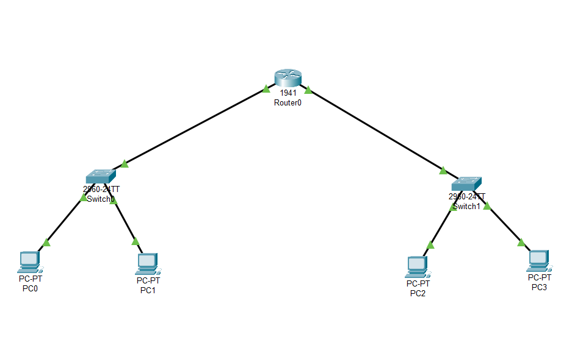
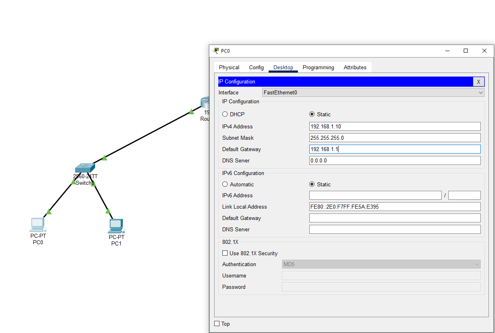
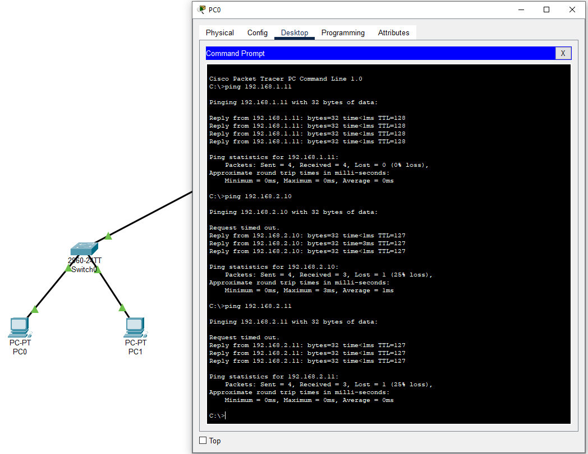

# Project 1 – Cisco Packet Tracer: Home Network Simulation

## 1. Project Overview

This project simulates a basic home network using Cisco Packet Tracer. The network includes two LANs connected through a router. Each LAN has its own switch and multiple endpoint devices. All devices were assigned static IP addresses, and network communication was verified using ping and Packet Tracer's simulation tools.

The goal was to demonstrate foundational networking concepts: IP addressing, routing between subnets, and Layer 2/Layer 3 device setup.

---

## 2. Network Topology and Design

### 2.1 Diagram

Below is the final layout of the simulated home network:



### 2.2 Devices Used

| Device       | Model          | Purpose                 |
|--------------|----------------|--------------------------|
| Router       | Cisco 1941     | Connects both LANs       |
| Switch x2    | 2960-24TT      | Connects devices within each LAN |
| PC0 – PC3    | Desktop PCs    | Simulate endpoint users  |

---

## 3. IP Addressing Scheme

Each LAN uses a different private IP subnet. Static IPs were assigned to all hosts, with the router acting as the default gateway.

### 3.1 Subnet Table

| Device     | IP Address      | Subnet         | Default Gateway   |
|------------|-----------------|----------------|-------------------|
| PC0        | 192.168.1.10    | 192.168.1.0/24 | 192.168.1.1       |
| PC1        | 192.168.1.11    | 192.168.1.0/24 | 192.168.1.1       |
| PC2        | 192.168.2.10    | 192.168.2.0/24 | 192.168.2.1       |
| PC3        | 192.168.2.11    | 192.168.2.0/24 | 192.168.2.1       |

---

## 4. Router Configuration

### 4.1 CLI Setup

Router interfaces were configured as follows:

```bash
enable
configure terminal

interface gig0/0
ip address 192.168.1.1 255.255.255.0
no shutdown
exit

interface gig0/1
ip address 192.168.2.1 255.255.255.0
no shutdown
exit
```
---
## 5. PC Configuration

Each PC was configured manually using Packet Tracer’s Desktop > IP Configuration panel.

- Example:
  - **PC0**
    - IP: `192.168.1.10`
    - Subnet Mask: `255.255.255.0`
    - Gateway: `192.168.1.1`

Repeat this setup for PC1–PC3, adjusting the IP address and gateway according to the subnet.



---

## 6. Connectivity Testing

### 6.1 Using Ping Commands

Once all devices were configured, basic connectivity was verified using the ping tool in each PC's command prompt.



### 6.2 Using PDU Tool

To further validate communication, I used the PDU tool to simulate traffic between devices.

  

---

## 7. Troubleshooting and Observations

### 7.1 Early Issues

- Initially, some pings failed due to incorrect IP configurations and cables not being connected properly.
- I resolved these issues by verifying port assignments and gateway settings on each PC.

### 7.2 Lessons Learned

- Every layer of the OSI model has a part to play, from cables (Layer 1) to addressing (Layer 3).
- Static IPs are simple but tedious to manage at scale, something DHCP can help with in future setups.
- The PDU tool in Packet Tracer provides valuable visibility for debugging.

---

## 8. Files and Resources

- [`HomeNetwork.pkt`](./HomeNetwork.pkt): Cisco Packet Tracer file
- `/images`: Folder with all configuration and test screenshots

---

## 9. Summary

This project gave me hands-on practice configuring a small home network using static addressing and manual router setup. It strengthened my understanding of Layer 2/3 networking and reinforced the value of network planning, documentation, and testing.
