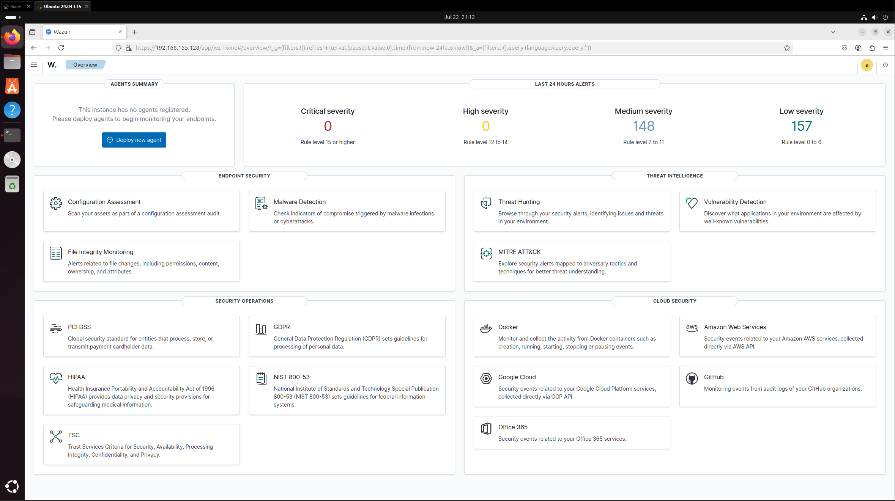

# Project 2 - Building a SIEM: Wazuh on Ubuntu 

## 1. Tools & Technologies  

- SIEM Platform: Wazuh (v4.7)  
- Operating System: Ubuntu 24.04 LTS (server and agent)  
- Hypervisor: VMware Workstation  
- Log Source: Second Ubuntu VM (agent)  
- Web Interface: Wazuh Dashboard (via Kibana)  
- Network Setup: Both VMs on the same NAT subnet with dynamic IPs assigned via DHCP  

---

## 2. Setup Process  

### 2.1 Wazuh Server Installation  

1. I deployed Ubuntu 24.04 LTS in VMware Workstation with 8GB RAM and 2 CPUs.  
2. After updating the OS, I downloaded the Wazuh all-in-one installation script using `curl` and ran the command to install the manager, indexer, dashboard, and local agent.  

   ```bash
   curl -sO https://packages.wazuh.com/4.7/wazuh-install.sh  
   sudo bash wazuh-install.sh -a  
   ```  

3. Once complete, I accessed the Wazuh dashboard from my host browser using the server's IP and default credentials.  

  


### 2.2 Ubuntu Agent Deployment  

1. I created a second Ubuntu 24.04 LTS VM to act as the monitored agent.  
2. I ensured both the server and agent VMs were assigned IPs within the same subnet.  

- Wazuh Server IP: 192.168.155.128  
- Agent VM IP: 192.168.155.129  

  

3. In the Wazuh dashboard, I used the "Deploy new agent" feature. I selected "Linux," chose "DEB amd64," entered the Wazuh server IP, and generated the installation command.  

  

4. I copied the generated command and ran it on the agent VM to install the Wazuh agent.  

  

5. After installation, I enabled and started the agent with the following:  

   ```bash
   sudo systemctl daemon-reload  
   sudo systemctl enable wazuh-agent  
   sudo systemctl start wazuh-agent  
   ```  

6. I verified that the agent appeared as "Active" in the Wazuh dashboard.  

  
  
  


### 2.3 Testing Log Collection  

I ran basic commands on the agent like `whoami`, `sudo`, and `apt update` to generate activity.  
The Wazuh dashboard captured these events and categorized them using MITRE ATT&CK mappings and the Threat Hunting module.  

  
  

---

## 3. Troubleshooting and Observations  

- The agent VM initially received a `.255` broadcast address, which prevented communication with the server. Rebooting the VM and renewing the DHCP lease resolved the issue.  
- When running the install script, I had to install `curl` manually on the agent before the command would work.  

  

- Early attempts using 4GB RAM on the Wazuh server resulted in failed services. Increasing the RAM to 8GB fixed these issues.  
- The agent didn’t appear immediately in the dashboard after install. Verifying the service status and manually starting it helped confirm it was online.  
- Command activity like `whoami` was logged but did not trigger immediate alerts. However, these actions were still visible in the MITRE and Threat Hunting views after processing.  

---

### 4. Summary  

In this project, I deployed a functional SIEM using Wazuh on Ubuntu 24.04 LTS. A second Ubuntu VM was configured as a monitored agent and successfully connected to the server. This setup allowed me to simulate system behavior and analyze logs using the Wazuh dashboard. Features like Threat Hunting and MITRE ATT&CK helped visualize event types and map actions to known attack categories.  
