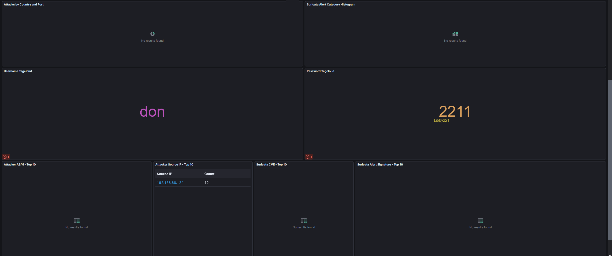

# Project 3 - Honeypot Deployment: T-Pot CE on Ubuntu

## 1. Tools & Technologies

- Honeypot Framework: T-Pot Community Edition (24.04.1)
- Operating System: Ubuntu Server 24.04 LTS
- Hypervisor: VMware Workstation
- Log and Visualization Stack: ELK (Elasticsearch, Logstash, Kibana)
- Web Interface: T-Pot Web UI (NGINX Frontend)
- Network Configuration: Bridged Adapter with internal IP assignment

---

## 2. Setup Process

### 2.1 T-Pot Installation

1. I deployed Ubuntu 24.04 LTS in VMware Workstation with 8GB RAM and 2 CPUs.
2. I updated the system and installed Docker and Docker Compose.

   

3. I cloned the official T-Pot repository from GitHub:

   ```bash
   git clone https://github.com/telekom-security/tpotce.git
   ```

   

4. I launched the installation script and selected the `Hive` install type.

   
   
   

5. After installation, I rebooted the VM and verified the T-Pot stack was running via Docker:

   
   

6. I also confirmed system resource usage using htop:

   

---

### 2.2 Accessing the Interface

After successful installation, I accessed the T-Pot Web UI using the bridged IP and assigned port:

- URL: `http://192.168.68.156:64297`

   

From there, I accessed Kibana, Spiderfoot, CyberChef, and Elasticvue. The system was stable and fully accessible through the browser.

---

### 2.3 Simulating Attack Traffic

To generate honeypot activity, I SSH’d into the honeypot’s IP using credentials that would trigger logging through the Cowrie container. This produced event logs in Kibana:

   

Kibana dashboards confirmed that the Cowrie honeypot captured my attempted login:

   
   

Additional logs were explored in the Discover tab:

   
   

This confirmed that credential-based access attempts and flow records were being recorded.

---

## 3. Troubleshooting and Observations

- Some Docker containers failed to bind to ports due to existing services (e.g., CUPS using port 631). I resolved this by stopping and disabling conflicting services.
- The `nginx` container did not appear immediately after installation. A full system reboot resolved this.
- T-Pot changed the default SSH port to `64295`, which required me to specify the port during login after reboot.
- Kibana's dashboards initially showed no data, but populated after simulated SSH interaction and internal scans.

---

### 4. Summary

This project involved deploying T-Pot CE in a virtualized environment to simulate and monitor hostile network activity. Using Cowrie, I triggered honeypot logs with SSH login attempts. Events were visualized and reviewed using Kibana, demonstrating successful event ingestion and mapping. This project provided hands-on experience with honeypots, container orchestration, and log analysis.

