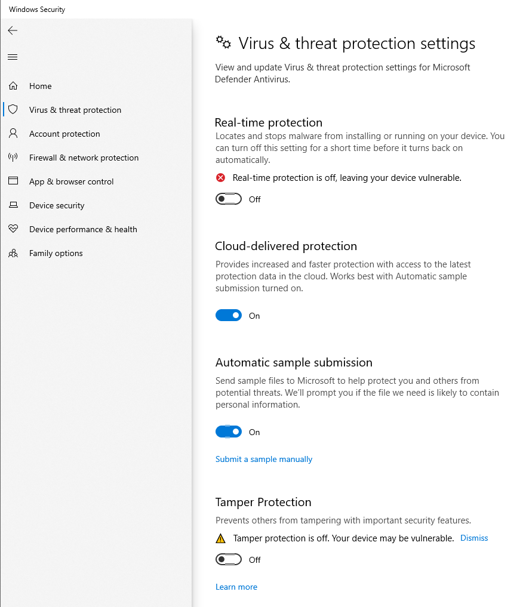
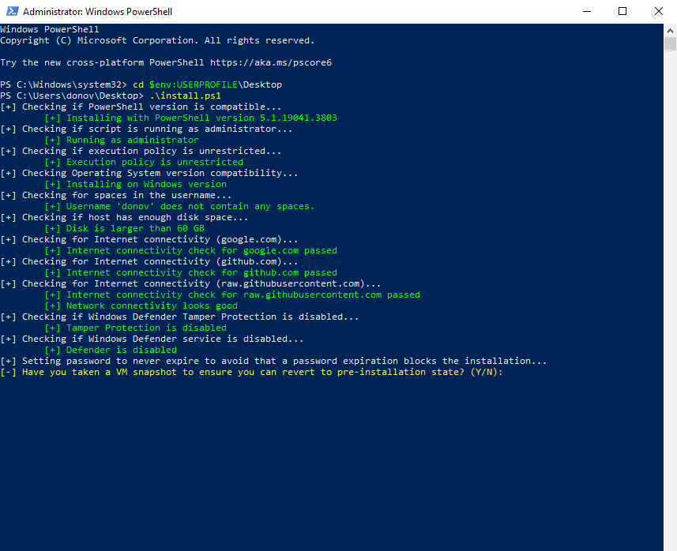

# Project 4 – Malware Analysis: FLARE VM and Network Forensics

## 1. Tools & Environment

- Analysis Environment: FLARE VM (Windows 10)
- Platform: VMware Workstation
- Network Tools: Wireshark
- Sample Source: [Malware-Traffic-Analysis.net](https://www.malware-traffic-analysis.net/2025/06/13/index.html)
- Artifacts: `.pcap` and forensic zip containing malicious PowerShell and executables

---

## 2. FLARE VM Setup Process

### 2.1 Windows VM Prep

I started with a clean Windows 10 VM and followed FLARE VM’s GitHub instructions to install the malware analysis environment. Pre-installation included disabling Windows Defender and tamper protection.

### 2.2 Installer and Snapshots

I downloaded and executed the FLARE install script via PowerShell. The script prompted for snapshots before proceeding. I took a pre-install snapshot and then launched the full install.

The installation included dozens of packages and several registry/system modifications.

### 2.3 Installation Complete

After a few hours, the install finalized. A PowerShell window confirmed success.

I created a new snapshot of this clean FLARE VM baseline to preserve the analysis environment.

---

## 3. Malware Sample & Environment

### 3.1 Files Imported

I downloaded the `.pcap` and forensic `.zip` archive from the exercise *"It's a Trap!"* (June 2025) on Malware-Traffic-Analysis.net. Files were securely transferred into the FLARE VM.

---

## 4. PCAP Analysis with Wireshark

### 4.1 DNS & Host Identification

I opened the `.pcap` file in Wireshark and filtered for DNS queries and IP traffic related to the suspected infected client (`10.6.13.133`). Repeated lookups for the domain `massfriction[.]com` stood out.

### 4.2 Suspicious HTTP Traffic

I then filtered for HTTP GET and POST requests. Multiple strange paths were requested, such as `/zH6QPFZtdK`. These were performed with the `WindowsPowerShell` User-Agent — a strong sign of malicious script execution.

### 4.3 Reconstructing a Malicious Payload

Using **“Follow HTTP Stream”**, I reconstructed the response body from the C2 server. It returned an obfuscated PowerShell script, confirming the system was being remotely controlled or further infected via in-memory scripting.

---

## 5. System Changes and Security Disabling

FLARE VM setup required disabling Defender and real-time protection, which was handled via group policy or registry edits.

---

## 6. Observations and IOCs

### 6.1 Indicators of Compromise

| Type         | Value                           |
|--------------|----------------------------------|
| Host IP      | `10.6.13.133`                   |
| Domain       | `massfriction[.]com`            |
| Hostname     | `DESKTOP-5AVE44C` (from pcap)   |
| MAC Address  | `24:77:03:ac:97:df`             |
| User-Agent   | `WindowsPowerShell/5.1.26100.4202` |
| HTTP Path    | `/zH6QPFZtdK`                   |

### 6.2 Findings

- The `.pcap` file showed traditional infection behavior: DNS resolution → HTTP GET → obfuscated PowerShell payload.
- This attack was stealthy, using PowerShell to pull and execute scripts directly in memory.
- DNS logs and HTTP streams provided a clear path to understanding the initial infection vector.

---

## 7. Summary

In this project, I deployed FLARE VM to conduct a controlled malware analysis exercise. By analyzing traffic captured during a simulated infection, I identified malicious PowerShell delivery over HTTP, DNS-based C2 behavior, and key system IOCs. This experience strengthened my understanding of malware staging, passive network analysis, and how attackers abuse built-in tools like PowerShell to bypass defenses.

---

## 8. Files and Resources

- `/images`: All FLARE VM install and analysis screenshots
- `2025-06-13-traffic-analysis-exercise.pcap`: Packet capture file from Malware-Traffic-Analysis.net
- `forensic-analysis.zip`: Artifact dump for further static analysis (not included here for safety)

